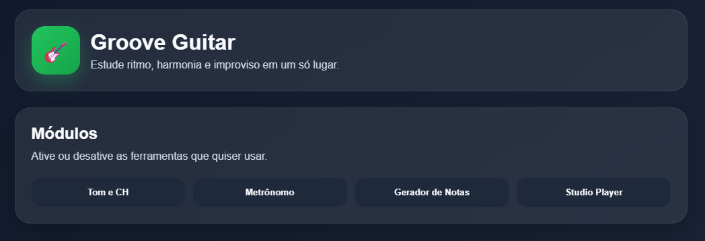

# 🎸 Groove Guitar

O **Groove Guitar** é um sistema web simples para estudo musical, criado para ajudar no treino de **ritmo**, **harmonia** e **improviso** em um só lugar.

A ideia do projeto é oferecer ferramentas úteis para o estudo diário de guitarra de forma prática, visual e organizada, sem precisar de login ou conta.

---

## ✨ Funcionalidades

### ✅ Módulos ativáveis
Logo abaixo do título do site, o usuário pode ativar ou desativar os módulos que deseja usar, deixando a interface mais limpa e personalizada.

### ✅ Tom e Campo Harmônico
O usuário escolhe o tom e o modo (**maior** ou **menor**) e o sistema gera:

- notas da escala
- campo harmônico do tom
- acordes clicáveis
- montagem de sequência harmônica em ordem

Isso permite estudar:
- escalas
- graus
- campo harmônico
- progressões de acordes
- composição e improviso

### ✅ Metrônomo
O sistema possui um metrônomo com:

- controle de BPM
- batidas visuais
- primeira batida mais forte
- suporte para estudo rítmico

### ✅ Gerador de Notas
O usuário pode gerar notas aleatórias para praticar improviso e explorar tonalidades diferentes.

### ✅ Studio Player
O Studio Player permite:

- subir músicas já baixadas no computador
- colar link do YouTube para ouvir no site

O objetivo é facilitar o estudo em cima de bases, músicas e referências.

---

## 🖼️ Imagens do sistema

### Tela inicial


### Tom e Campo Harmônico


### Studio Player


### BPM e Gerador de Notas
<!-- Ajuste o nome abaixo se necessário -->


---

## 🚀 Tecnologias utilizadas

- **HTML**
- **CSS**
- **JavaScript**

---

## 🎯 Objetivo do projeto

Esse projeto foi criado com foco em estudo musical e prática de guitarra, reunindo ferramentas essenciais em uma única interface.

A proposta é tornar o treino mais dinâmico, permitindo que o usuário combine:

- metrônomo
- escalas
- campo harmônico
- progressões
- estudo com áudio

---

## 📂 Estrutura do projeto

```bash
groove-guitar/
│── index.html
│── style.css
│── script.js
└── img/
    │── Inicial.png
    │── studio player.png
    │── tom e ch.png
    └── bpm e gerador de notas.png